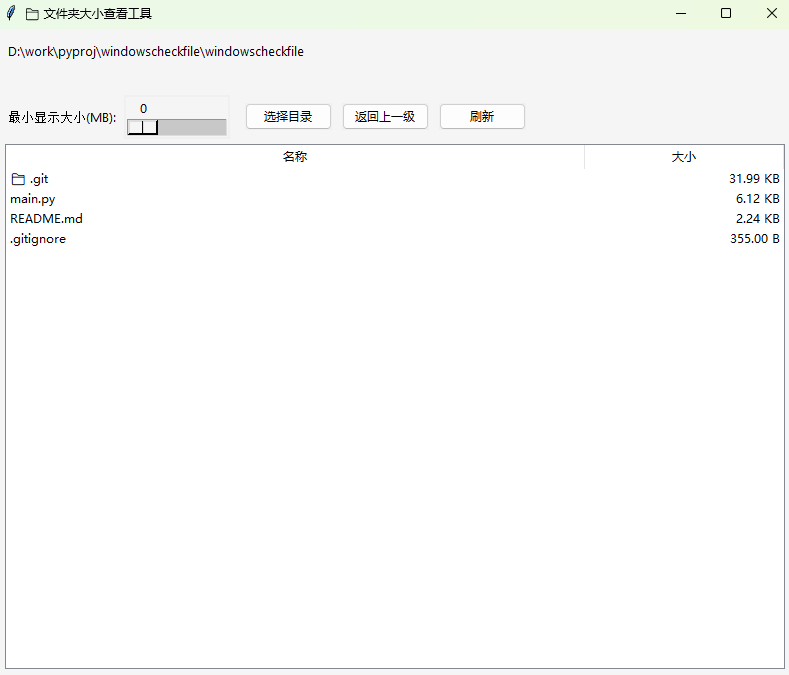

# 📁 文件夹大小查看工具（Python GUI）

一个使用 `Tkinter` 图形界面编写的文件夹大小查看器，支持多线程计算、显示忽略文件统计、目录导航等实用功能。

---

## ✨ 功能特点

- ✅ 现代化图形界面（基于 Tkinter）
- ✅ 支持选择任意目录
- ✅ 自动统计每个文件夹或文件的占用空间
- ✅ 显示"📁"图标区分目录和文件
- ✅ 可设置最小显示大小（MB），忽略较小文件
- ✅ 显示被忽略文件总占用空间
- ✅ 多线程加速目录体积计算
- ✅ 顶部显示当前路径、进度条与提示信息
- ✅ 支持双击进入子目录 & 返回上一级

---

## 🖼️ 截图示意

> 主界面预览：



---

## 🧰 使用方法

### 1. 安装依赖

> 本程序 **无需任何额外依赖库**，仅需安装标准 Python 3 即可运行。

### 2. 克隆或下载代码

```bash
git clone https://github.com/yourname/folder-size-viewer.git
cd folder-size-viewer
```

### 3. 运行程序

```bash
python disk_browser_gui.py
```

---

## 🖱️ 操作说明

- **选择目录**：点击按钮选择任意文件夹进行分析
- **滑动设置最小显示大小**（单位：MB）
  - 仅用于过滤较小文件
  - 更改滑动条不会立即刷新
- **点击"刷新"按钮**：重新计算文件夹大小
- **双击某项**：进入子目录
- **点击"返回上一级"**：回到上层目录
- 顶部会提示被过滤的文件总占用空间

---

## 🖥️ 打包为 `.exe`（可选）

如需生成 Windows 可执行文件，请参考：

```bash
pip install pyinstaller
pyinstaller --noconsole --onefile disk_browser_gui.py
```

打包后会在 `dist/` 目录生成 `disk_browser_gui.exe`。


---

## 📂 目录结构

```
folder-size-viewer/
│
├── disk_browser_gui.py        # 主程序文件
├── README.md                  # 本说明文件
└── icon.png                   # 可选图标（用于打包）
```

---

## 📄 许可证

本项目遵循 MIT License，可自由使用、修改、分发。

---

## 🙋‍♀️ 开发者

作者：[你的名字或 GitHub 链接]  
如需增强功能（导出 CSV、右键菜单、图形图表等），欢迎提 Issue 或 PR！
